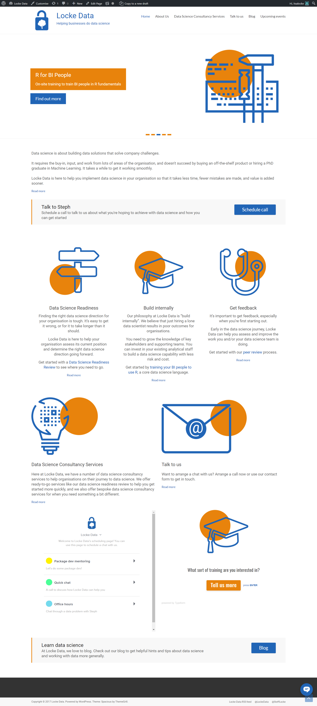

# Redoing the homepage! test

- Company: Locke Data
- Tagline: Helping businesses do data science

## Menu
- Home
- About Us
- Data Science Consultancy Services
  + Data Science Readiness
  + Training: R for BI people
  + Model audits / Peer Review
- Talk to us
- Blog
- Upcoming events

## Layout  
The page consists of:

1. A carousel
2. Spiel
3. Call to Action - schedule call
4. 3 x Services
5. Consultancy Services & Contact Us
6. Calendly scheduler & Typeform training survey
7. Call to Action - read blog

## Components' copy

### Carousel
This is transient content showcasing what I want to boost right now.

- R and Microsoft: Training day in London, June 28th **Read more**
- Upcoming community events: Our upcoming public workshops, community talks, etc **Read more**
- R for BI People: On-site training to train BI people in R fundamentals **Find out more**
- Is your organisation ready?: Avoid the risk of a failed initiative and start implementing data science the right way **Read more**
- Lone data scientist?: Let us be your team and peer review service! **Read more**

### Spiel
**We know how to make data science work for you.**

Problems with data will mean that mistakes are made and time is wasted. Value will easily drain away from your organisation.

Locke Data is here to stop that from happening. With our help, you can spend less time on needless admin and more time with the exciting parts of your next big project.

### Call to Action - schedule call
#### Schedule Call Now
It's easy to get started. Organise your free call in the time it'll take you to brew yourself a coffee.
**Schedule call now**
### 3 x Services

#### Strategy review

Assess your current position and find the right data science solution for you.

[Read more](https://itsalocke.com/data-science-readiness/)

#### Develop and grow

Invest in your staff to build a data science capability with less risk and cost.

[Read more](https://itsalocke.com/build-internally/)

#### Get a second opinion

Get an assessment and improve the work you and/or your data science team is already doing. You might also want a [peer review](https://itsalocke.com/model-audits/).

[Read more](https://itsalocke.com/get-feedback/)

### Consultancy Services & Contact Us

#### Data Science Consultancy Services
Here at Locke Data, we have a number of data science consultancy services to help organisations on their journey to data science. We offer ready-to-go services like our data science readiness review to help you get started more quickly, and we also offer bespoke data science consultancy services for when you need something a bit different.

#### Talk to us
Want to arrange a chat with us? Arrange a call now or use our contact form to get in touch.

### Calendly scheduler & Typeform training survey

### Call to Action - read blog
### Learn data science
At Locke Data, we love to blog. Check out our blog to get helpful hints and tips about data science and working with data more generally.
**Blog**

## Before shot

